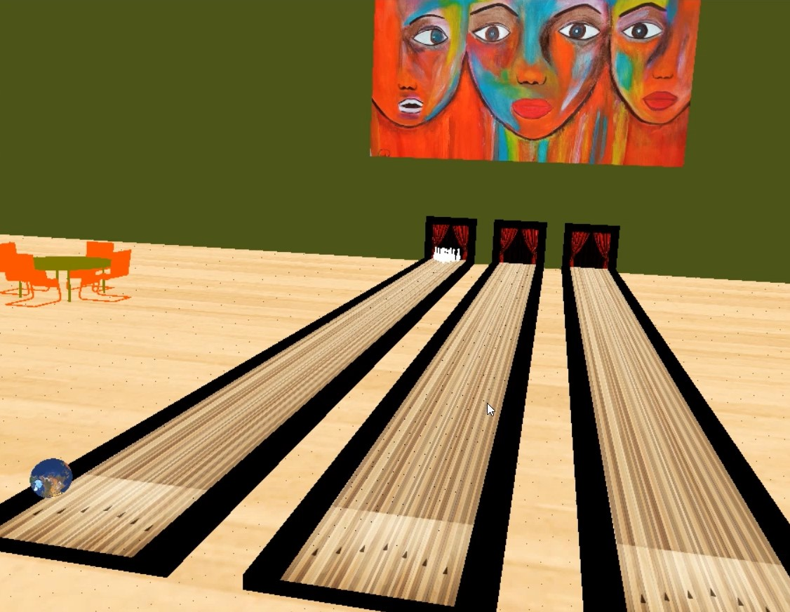

<h1 align="center">
    <a href="https://rajathpi.github.io/space-shooter/" style="text-decoration:none;">Physical Simulation of Bowling Ball [OpenGL - C++]</a>
</h1>

  

    
  

  <a href="https://github.com/ashraftryfie/Physical_simulation_of_bowling_ball_OpenGL-cpp/src/main.cpp"
  style="text-decoration:none;font-weight:700;color:#ffe082;">
  Source Code
  
  </a>

## **Installation: 👨🏻‍🏫**

1) Install **[Visual Studio](https://visualstudio.microsoft.com/downloads/)** 
2) Insall **[OpenGL](https://www.transmissionzero.co.uk/software/freeglut-devel/)** 

## **Simulation Description: 📝**

* Simple simulation of bowling ball movement from throwing the ball to hitting/not hitting the pipes at the end.
* Therefore, the simulation is divided here into two phases:
  1. Ball throwing stage
  2. Ball movement and sliding stage

**Keybord control keys: 🕹**
> VK_UP => Move Forward  
> VK_DOWN => Move Backward  
> VK_RIGHT => Move Right  
> VK_LEFT => Move Left  
> Z => Move Upward  
> X => Move Downward  

> W => Direction to right  
> S => Direction to left  
> A => Direction to Up  
> D => Direction to Down  
<!-- > Q - RotateZ in in negative   -->
<!-- > E - RotateZ in in positive   -->

> 🎱 Ball:  [O] Move the ball - [P] Stop the ball.  
> 🎵 Music: [Y] resume music 🔊 - [U] pause music 🔈

## **Objective: 🎯**

* Simulate the bowling ball movement.  
* Each time a user gets shot.
